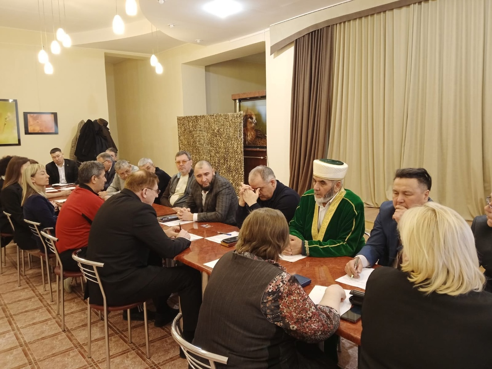
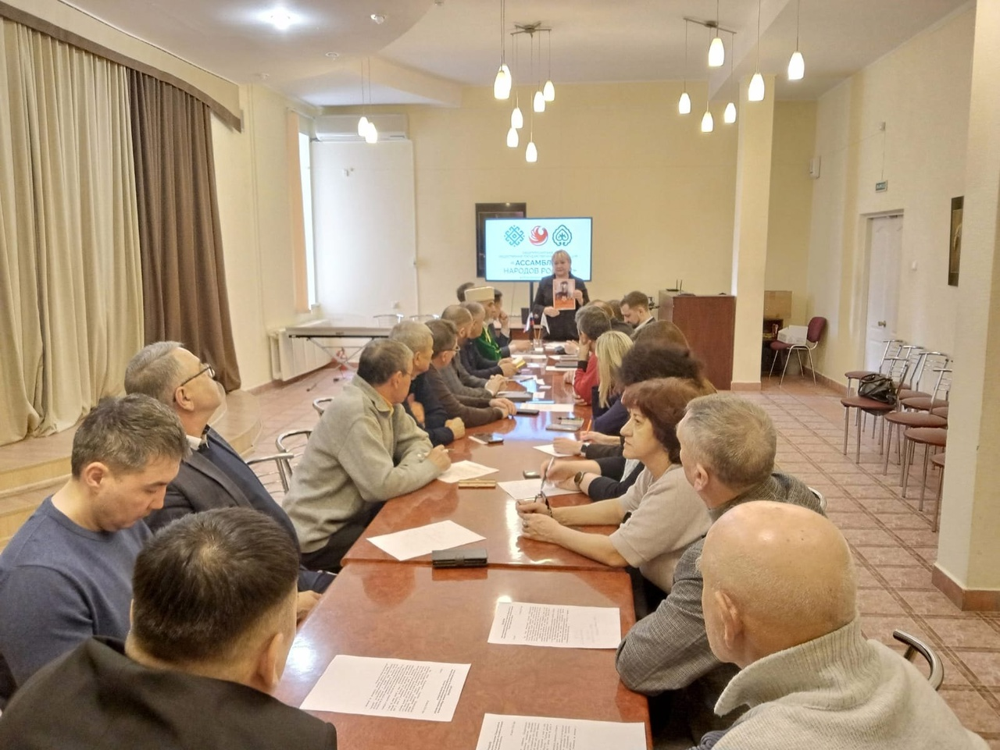

Темой встречи обозначили сохранение межнационального мира и согласия народов Курганской области.
В мероприятии приняли участие представители силовых структур Курганской области, национальных и Религиозных объединений. 
По итогу заседания было принято обращение членов Совета Регионального отделения Общероссийской общественно-государственной 
организации «Ассамблея народов России» Курганской области к жителям Курганской области.

Председатель КГРОМ Зиёдали Курбонович Мизробов выступил со словами:" Россия - многонациональная и многоконфессиональная страна.
Мы говорим на разных языках, у нас есть разница в менталитете, традициях, религии. Но мы живем в единой стране уже веками, 
вместе работаем, вместе защищаем родину, вместе радуемся победам и вместе переживаем трудности, нас объединяет то, что мы 
единая российская нация.

События, произошедшие 22 марта 2024 года, потрясли всю нашу страну, весь мир. Террористы, расстрелявшие мирных граждан, 
а точнее заказчики теракта, хотят внести раздор и разлад в обществе, посеять вражду между народами нашей страны.
Поэтому восстановить мир, не допустить распространения терроризма — это важнейшая задача сегодня.

В Кур'ане сказано:

مِنْ أَجْلِ ذَٰلِكَ كَتَبْنَا عَلَىٰ بَنِىٓ إِسْرَٰٓءِيلَ أَنَّهُ ۥ مَن قَتَلَ نَفْسًۢا بِغَيْرِ نَفْسٍ أَوْ فَسَادٍ فِى ٱلْأَرْضِ فَكَأَنَّمَا قَتَلَ ٱلنَّاسَ جَمِيعًا وَمَنْ أَحْيَاهَا فَكَأَنَّمَآ أَحْيَا ٱلنَّاسَ جَمِيعًا ۚ وَلَقَدْ 
جَآءَتْهُمْ رُسُلُنَا بِٱلْبَيِّنَٰتِ ثُمَّ إِنَّ كَثِيرًا مِّنْهُم بَعْدَ ذَٰلِكَ فِى ٱلْأَرْضِ لَمُسْرِفُونَ

"По этой причине Мы предписали сынам Исраила (Израиля): кто убьет человека не за убийство или распространение нечестия на 
земле, тот словно убил всех людей, а кто сохранит жизнь человеку, тот словно сохранит жизнь всем людям. Наши посланники уже 
явились к ним с ясными знамениями, но многие из них после этого излишествуют на земле." Аль-Маида, 32 аят.

В Исламе, терроризм – чуждое и запретное явление. Террор не имеет ничего общего с исламом, и категорически нельзя данный термин связывать с исламом. Терроризм это настоящая вражда. Нельзя верующего, будь то мусульманин или христианин, назвать террористом. У террора нет нации, религии, расовой принадлежности.

Наша задача, объединиться, быть сплоченными, не идти на поводу у невежд, а продолжать жить вместе в мире и взаимопонимании. Вместе бороться с преступниками, защищать честь нашей державы, воспитывать новое поколение, уважать друг друга."
