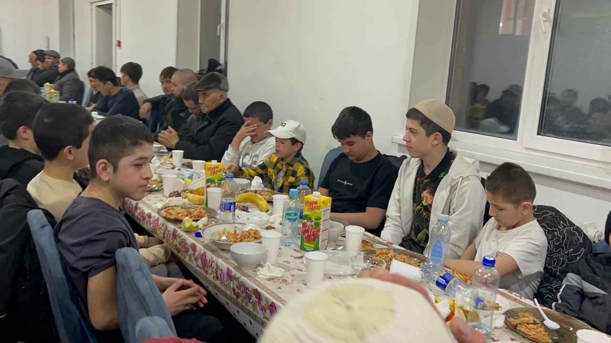

От Ибн ‘Умара сообщается, что Посланник Аллахаﷺ сказал: «Самые любимые люди для Аллаха — это самые полезные из них, 
а самое любимое деяние перед Аллахом Всемогущим и Великим — эта радость, 
которую ты приносишь мусульманину или помогаешь ему в беде или выплачиваешь за него долг или утоляешь его голод.»

