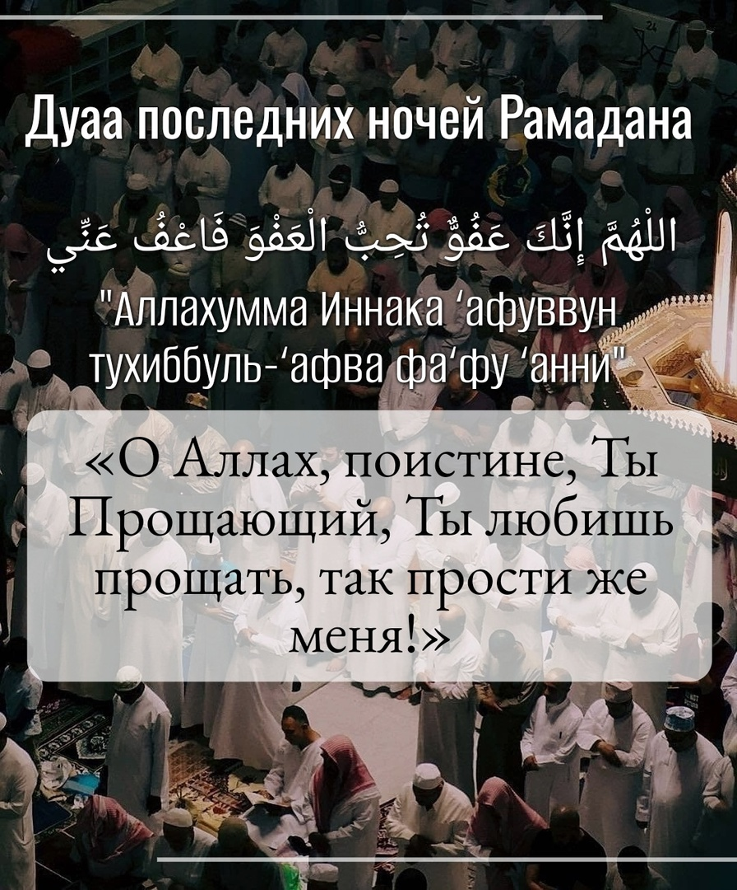

От Айши (да будет доволен ею Аллах) передаётся, что она сказала Пророку ﷺ: «О посланник Аллаха, если я застану ночь 
Ляйлятуль Кадр, что мне следует сказать?». Пророкﷺ ответил: «Скажи:

اللْهُمَّ إِنَّكَ عَفُوٌّ تُحِبُّ الْعَفْوَ فَاعْفُ عَنِّي

"Аллахумма Иннака ‘афуввун тухиббу ль-‘афва фа‘фу ‘анни"
«О Аллах, поистине, Ты Прощающий, Ты любишь прощать, так прости же меня!»

Пусть Всевышний Аллах укрепит нас на единобожии и приблизит к Себе.

