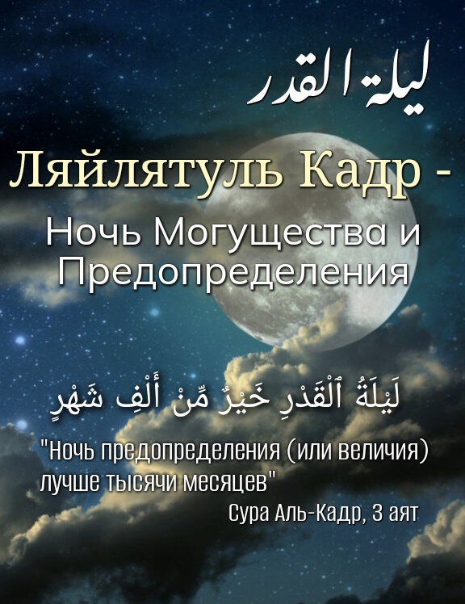

Наступила последняя декада Рамадана, и в последние дни этого священного месяца, мы встречаем ночь, 
которая лучше тысячи месяцев. Эта ночь заключает в себе много добра и благодати. Духовное наслаждение и блаженство 
доходят в эту ночь напрямую. С одной стороны, мы переживаем печаль от того, что миновал целый месяц, наполненный милостью и 
благоденствием. А с другой стороны, мы радуемся, что встречаем ночь аль-Кадр, в которую можно заработать столько савабов, 
сколько человек может достичь лишь за целую жизнь.

عن عائشة رضي الله عنها قالت: كان رسول اللهﷺ إذا دَخَلَ العَشْرُ أَحْيَا الليلَ، وأَيْقَظَ أَهْلَهُ، وَجَدَّ وَشَدَّ المِئْزَرَ

‘Аиша (да будет доволен ею Аллах)передаёт: «Когда наступала последняя декада рамадана, Посланник Аллахаﷺ посвящал ночи 
поклонению, будил своих домочадцев [для дополнительных молитв], усердствовал в поклонении и затягивал изар.(Аль-Бухари, 
Муслим).

В другом хадисе, также переданном от Аиши (да будет доволен ею Аллах), сказано:

كَانَ رَسُولُ اللَّهِ ﷺ يَجْتَهِدُ فِي العَشْرِ الأَوَاخِرِ مَا لَا يَجْتَهِدُ فِي غَيْرِهَا

«Посланник Аллахаﷺ усердствовал (в поклонении) в последние десять дней так, как не усердствовал в другие(дни Рамадана)» 
(«Сунан» ат-Тирмизи).

Ляйлятуль Кадр - это благославенная ночь, когда на землю спускаются тысячи ангелов и принимаются дуа. 
Чтобы указать на величие Ночи могущества, Всевышний ниспослал суру «Аль-Кадр» («Ночь Предопределения»):

إِنَّآ أَنزَلۡنَٰهُ فِي لَيۡلَةِ ٱلۡقَدۡرِ ١ وَمَآ أَدۡرَىٰكَ مَا لَيۡلَةُ ٱلۡقَدۡرِ ٢ لَيۡلَةُ ٱلۡقَدۡرِ خَيۡرٞ مِّنۡ أَلۡفِ شَهۡرٖ ٣ تَنَزَّلُ ٱلۡمَلَٰٓئِكَةُ وَٱلرُّوحُ فِيهَا بِإِذۡنِ رَبِّهِم مِّن كُلِّ أَمۡرٖ ٤ سَلَٰمٌ هِيَ حَتَّىٰ مَطۡلَعِ ٱلۡفَجۡرِ ٥

"Воистину, Мы ниспослали это (Откровение) в Ночь могущества (Ляйляту-ль-Кадр). Откуда тебе знать, что есть Ночь могущества? 
Ночь могущества лучше тысячи месяцев. В эту Ночь ангелы и Дух нисходят с дозволения Аллаха по всем Его повелениям. Она есть 
мир!.. Вплоть до наступления зари".

Какая именно ночь ей является, знает лишь Аллах. Поэтому пророк Мухаммадﷺ сам выстаивал ночи, проводил больше времени 
молитвах, поклонениях, а также призывал к этому своих сподвижников.

Всевышний по своей милости меняет судьбу своего раба в ночь Ляйлятуль-Кадр.
Ночь Предопределения согласно Корану может быть в одной из 10 последних ночей Рамадана.
Если провести эту ночь в молитвах, в осмыслении своих деяний и возможных ошибок, то Аллах простит ему грехи и будет милостив  
и может изменить судьбу. В этом великое благо для верующих.

В эту ночь читают Коран, делают зикр, салават Посланнику Аллахаﷺ, не стоит забывать просить прощение у Аллаха, делать как 
можно больше дуаа. Аяты Корана подобны лекарству. Когда аяты достигают души, сердца верующего, они дают исцеление. Также 
нужно усердствовать и со смирением и верой выполнять намазы, ночные молитвы в эту ночь. За это будет получена награда 
подобная той, если бы мы исполняли намаз на протяжении 1000 месяцев.

Поклонение Аллаху в Ляйлятуль-Кадр делает нас ближе к Аллаху, готовит нам место в вечном мире (Ахирате). 
Пусть Аллах Свят Он и Велик, примет наше поклонение Ему, сделает так, чтобы мы получили все блага, заложенные в этой ночи.
