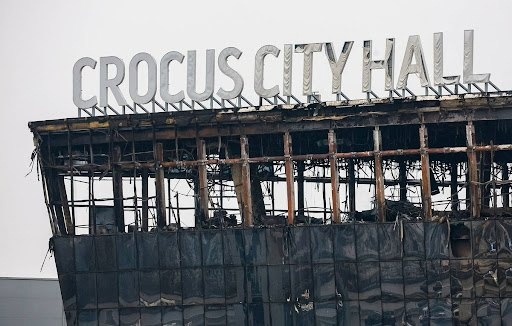
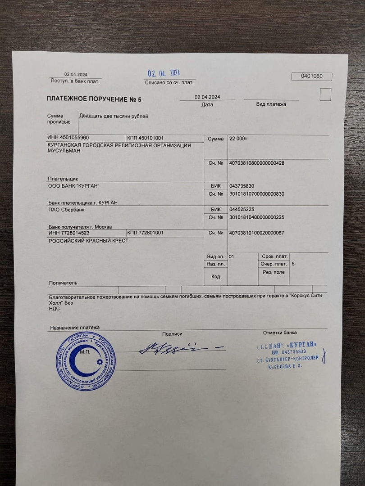

Ассаляму алейкум ва рахматуллахи ва баракятух. Мусульмане Курганской Соборной мечети помогают пострадавшим в теракте.

Курганская городская религиозная организация мусульман во главе с председателем Зиёдали Курбоновичем Мизробовым пожертвовали 
деньги на помощь пострадавшим в теракте "Крокус Сити Холл".

ٱلَّذِينَ يُنفِقُونَ أَمْوَٰلَهُم بِٱلَّيْلِ وَٱلنَّهَارِ سِرًّا وَعَلَانِيَةً فَلَهُمْ أَجْرُهُمْ عِندَ رَبِّهِمْ وَلَا خَوْفٌ عَلَيْهِمْ وَلَا هُمْ يَحْزَنُونَ

«Тем, кто расходует свое имущество ночью и днем, тайно и явно, уготована награда у их Господа. Они не познают страха и не будут опечалены», Сура Аль-Бакара, аят 274.

Пусть Аллах дарует терпение семьям погибших и скорейшее выздоровление пострадавшим в этой страшной трагедии.

