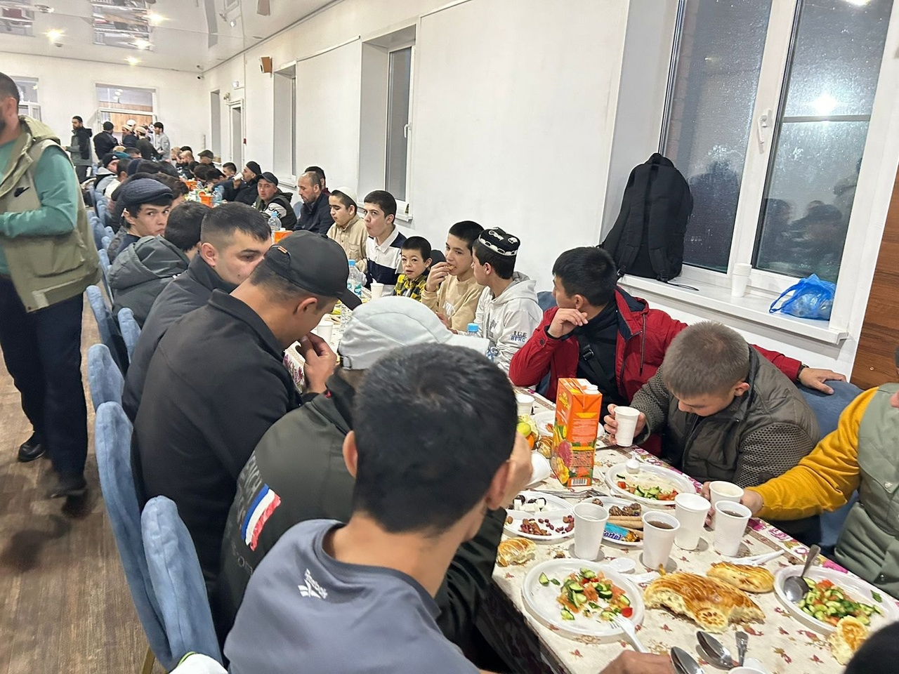
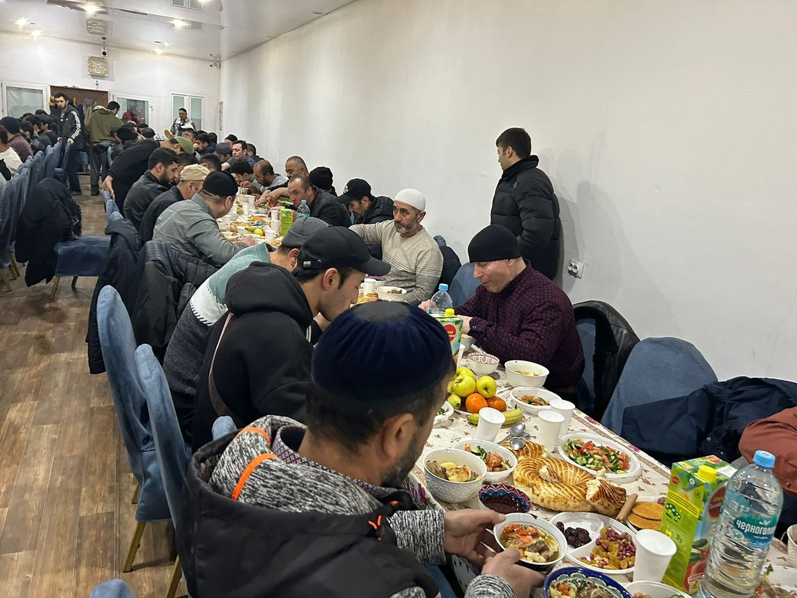

От Абу Хурайры (да будет доволен им Аллах) передаётся, что Посланник Аллаха (мир ему и благословение Аллаха) сказал:

أُعْطِيَتْ أُمَّتِي خَمْسَ خِصَالٍ فِي رَمَضَانَ، لَمْ تُعْطَهَا أُمَّةٌ قَبْلَهُمْ: خُلُوفُ فَمِ الصَّائِمِ أَطْيَبُ 
عِنْدَ اللهِ مِنْ رِيحِ الْمِسْكِ، وَتَسْتَغْفِرُ لَهُمُ الْمَلَائِكَةُ حَتَّى 
يُفْطِرُوا، وَيُزَيِّنُ اللهُ عَزَّ وَجَلَّ كُلَّ يَوْمٍ جَنَّتَهُ، ثُمَّ يَقُولُ: يُوشِكُ عِبَادِي الصَّالِحُونَ أَنْ يُلْقُوا عَنْهُمُ الْمَئُونَةَ وَالْأَذَى وَيَصِيرُوا إِلَيْكِ، 
وَيُصَفَّدُ فِيهِ مَرَدَةُ الشَّيَاطِينِ، فَلَا يَخْلُصُوا فِيهِ إِلَى مَا كَانُوا يَخْلُصُونَ إِلَيْهِ فِي غَيْرِهِ، 
وَيُغْفَرُ لَهُمْ فِي آخِرِ لَيْلَةٍ " قِيلَ: يَا رَسُولَ اللهِ، أَهِيَ لَيْلَةُ الْقَدْرِ؟ قَالَ: لَا، وَلَكِنَّ الْعَامِلَ إِنَّمَا يُوَفَّى أَجْرَهُ إِذَا قَضَى عَمَلَهُ

«Моей умме в месяце Рамадан дарованы пять благ, которые не были дарованы предыдущим общинам:

1. запах изо рта постящегося, который для Аллаха приятнее, чем благоухание мускуса;

2. ангелы молят о прощении для за них вплоть до разговения;

3. каждый день Аллах украшает Свой Рай и говорит: "Близко то время, когда праведные рабы Мои сбросят с себя бремя тягот и
   беспокойства и устремятся к тебе";

5. мятежных дьяволов заковывают в цепи, и они не могут делать то, что они делают в другое время;

6. постящиеся удостаиваются прощения в последнюю ночь месяца».

Люди спросили: «О Посланник Аллаха, это ночь предопределения (Лайлатуль Кадр)?» Он ответил: «Нет, просто труженик получает 
свою награду сполна, когда завершает начатое дело. (Имам Ахмад)

