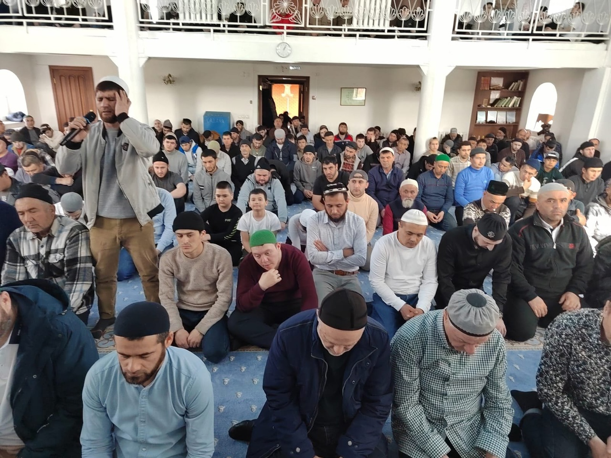

 Зиёдали Курбонович провел хутбу на тему: "Ляйлятуль Кадр - ночь предопределения".

Ночь Предопределения, Могущества – самая значимая ночь, упомянутая в Коране в суре «аль-Кадр». Первые отрывки Священного 
Корана были ниспосланы Посланникуﷺ именно в эту ночь.

قال الله سبحانه وتعالى

إِنَّآ أَنزَلۡنَٰهُ فِي لَيۡلَةِ ٱلۡقَدۡرِ ﴿ ۱ ﴾

وَمَآ أَدۡرَىٰكَ مَا لَيۡلَةُ ٱلۡقَدۡرِ ﴿ ۲ ﴾

لَيۡلَةُ ٱلۡقَدۡرِ خَيۡرٞ مِّنۡ أَلۡفِ شَهۡرٖ ﴿ ۳ ﴾

تَنَزَّلُ ٱلۡمَلَٰٓئِكَةُ وَٱلرُّوحُ فِيهَا بِإِذۡنِ رَبِّهِم مِّن كُلِّ أَمۡرٖ ﴿ ۴ ﴾

سَلَٰمٌ هِيَ حَتَّىٰ مَطۡلَعِ ٱلۡفَجۡرِ ﴿ ۵ ﴾

«Воистину, Мы ниспослали его (Коран) в Ночь предопределения (или величия). Откуда ты мог знать, что такое ночь 
предопределения (или величия)? Ночь предопределения (или величия) лучше тысячи месяцев. В эту ночь ангелы и Дух (Джибрил) 
нисходят с дозволения их Господа по всем Его повелениям. Она благополучна вплоть до наступления зари», Сура Аль-Кадр, 1-5 аяты.

Кто в эту ночь три раза будет говорить

لا إله إلا الله، محمدٌ رسول الله,

тому Аллах простит его грехи и разрешит войти в Рай.

Муса (алейхи Салям) обращался к Аллаху: "О Господь, я хочу приблизиться к Тебе"

Аллах Азза Ва Джаль ответил: "О Муса, кто в ночь Предопределения не будет спать, и проведёт ночь в поклонении, эти люди 
близки ко Мне."

Муса спросил: "О, Аллах, я хочу Твоей Милости" Аллах ответил: "О Муса, Милость Моя на тех людях, кто оказывает милость 
мусульманам в ночь предопределения."

Муса спросил: "О Аллах, как в Судный день пройти мост Сират? "

Аллах отвечает:" О Муса, кто в ночь Кадр бедным даёт садака, того Я первым проведу через мост Сират."

Муса снова спрашивает: "О, Аллах, я хочу спастись от Ада. Аллах Свят Он и Велик отвечает:" О Муса кто в ночь Предопределения 
много зикра делает, восхваляет Меня, того спасу от Адского Огня.

Муса спросил:" О, Аллах, как заслужить Рая, и всех его прелестей (хочу есть фрукты под тенью райского дерева)?

Аллах ответил:"Кто много тасбих делает в ночь предопределения, тот будет в тени Райского дерева кушать фрукты."

Муса спрашивает:" О, Аллах, хочу найти Твоё довольствие, как мне это сделать?"

Аллах отвечает :"Кто в ночь предопределения прочитает 2 ракаата ради Меня, тот найдёт Моё довольство."

Ибн Аббас(да будет доволен им Аллах) передаёт со слов Мухаммадаﷺ:

" Кто в ночь Предопределения прочитает 2 ракаата, 1 раз фатиха, 7 раз сура Аль Ихлас, после завершения намаза скажет 70 раз:

أسْتَغْفِرُ اللَّهَ وَ أتُوبُ إلَيْهِ

Астагфируллаха ва атубу илейхи. (Я прошу Аллаха о прощении и каюсь Ему), Аллах простит его и его родителей. Аллах прикажет 
ангелам построить этому рабу дом в Раю, рядом с которым течёт река и растут деревья, и раб не уйдёт из этого мира до тех пор, 
пока не заслужит свое место в Раю."

В эту ночь ниспосылаются ангелы"

Ибн Касир в своём «Тафсире», комментируя слова Всевышнего сказал: «То есть в эту ночь умножается нисхождение ангелов, учитывая
её особую благодать. Ангелы нисходят с благодатью и милостью, как нисходят они при чтении Корана, окружают собрания 
поминающих Аллаха и преклоняют крылья перед искателем знаний, возвеличивая его ».

Посланник Аллахаﷺсказал: «Поистине, в Ночь предопределения ангелов на земле больше, чем мелких камешков» (Ибн Хузайма).

