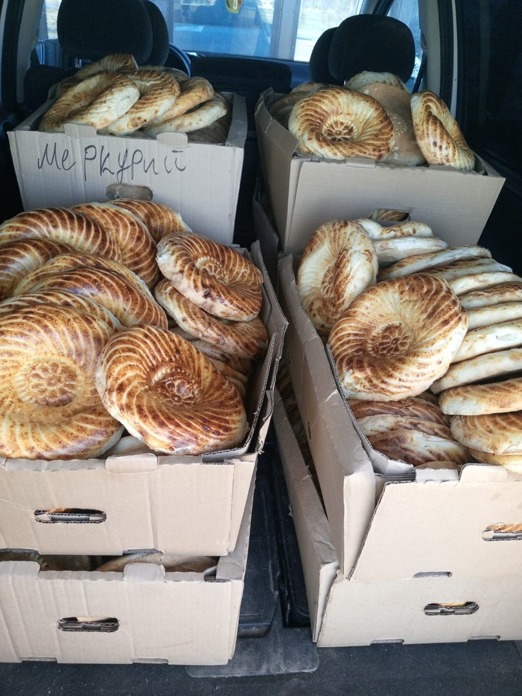
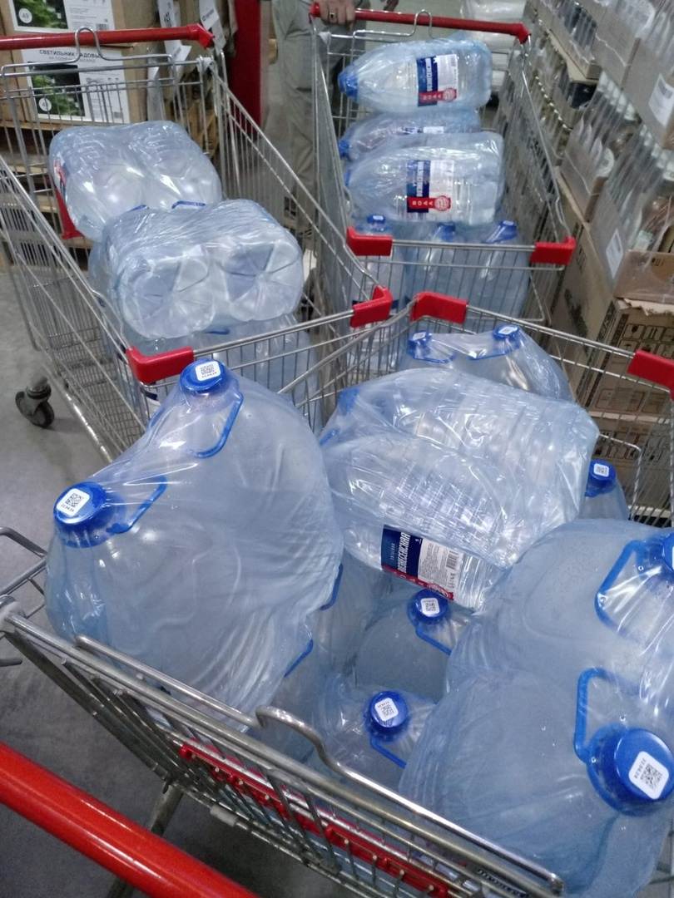
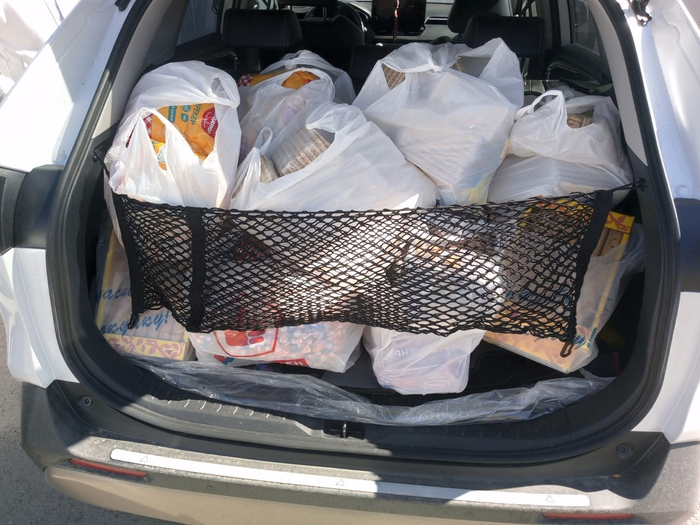

Таджикская диаспора в Кургане купили и отправили братьям продукты питания (вода, хлеб, печенье) и памперсы для детей.

Более 500 граждан Таджикистана уже третий день подряд находятся на границе между Петухово - Казахстан.

На казахстанско-российской границе застряли люди, среди которых много женщин и детей: российские власти не впускают их в Россию.

Пусть Всевышний Аллах поможет братьям и дарует всем терпения.

