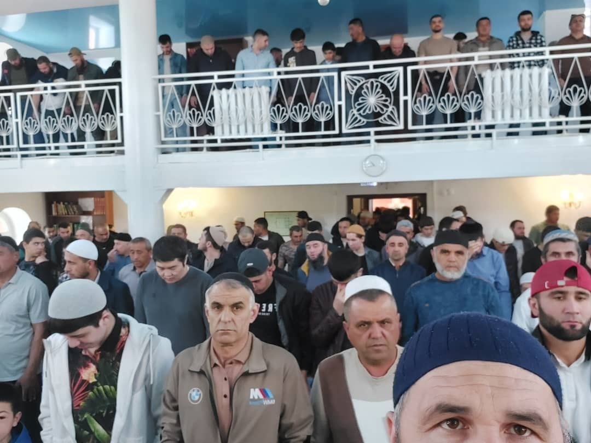

Зиёдали Курбонович в проповеди рассказал историю возведения Каабы.

قال الله سبحانه وتعالى

إِنَّ أَوَّلَ بَيْتٍ وُضِعَ لِلنَّاسِ لَلَّذِى بِبَكَّةَ مُبَارَكًا وَهُدًى لِّلْعَٰلَمِينَ

"Воистину, первым домом, который воздвигнут для людей, является тот, что находится в Бекке (Мекке). 
Он воздвигнут как благословение и руководство для миров."

فِيهِ آيَٰتٌۢ بَيِّنَٰتٌ مَّقَامُ إِبْرَٰهِيمَ ۖ وَمَن دَخَلَهُ ۥ كَانَ آمِنًا ۗ وَلِلَّهِ عَلَى ٱلنَّاسِ حِجُّ ٱلْبَيْتِ مَنِ ٱسْتَطَاعَ إِلَيْهِ سَبِيلًا ۚ وَمَن كَفَرَ فَإِنَّ ٱللَّهَ غَنِىٌّ عَنِ ٱلْعَٰلَمِينَ

"В нем есть ясные знамения - место Ибрахима. Кто войдет в него, окажется в безопасности. 
Люди обязаны перед Аллахом совершить хадж к Дому (Каабе), если они способны проделать этот путь. 
Если же кто не уверует, то ведь Аллах не нуждается в мирах." сура Али Имран, 96-97 аяты.

