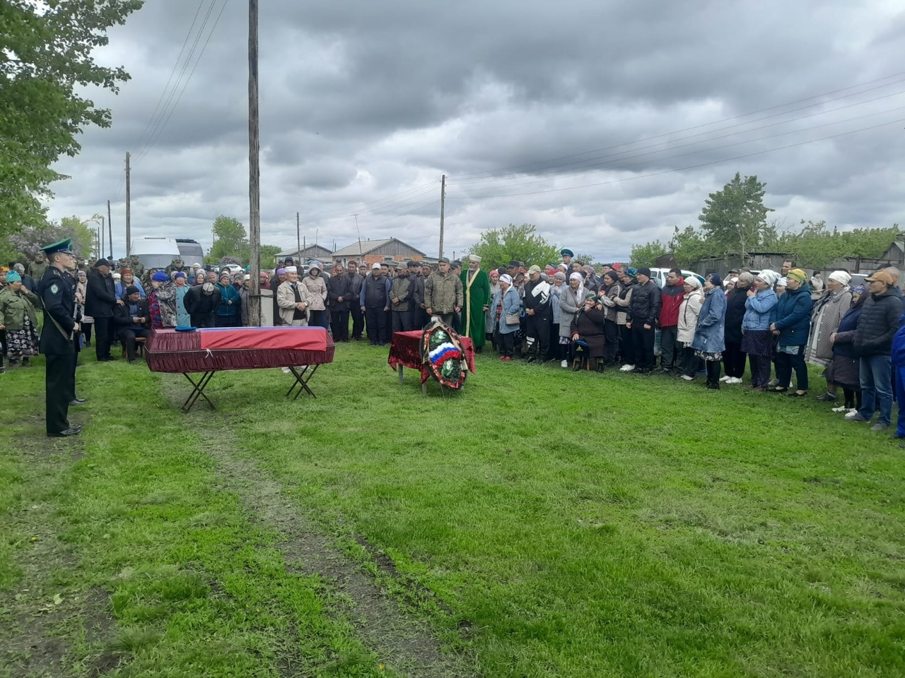

В 2010 году Кайрат отслужил в армии, когда началась специальная военная операция на Украине, поехал туда. Дослужил до звания 
сержанта, защищая мирных граждан.
От имени мусульман Курганской области выражаем глубокие соболезнования семье Кайрата, у него остались дети, жена, отец и брат, 
терпения им и стойкости.
Всевышний Аллах говорит в Коране:
وَلَا تَحْسَبَنَّ الَّذِينَ قُتِلُوا فِي 
سَبِيلِ اللَّهِ أَمْوَاتًا ۚ بَلْ أَحْيَاءٌ عِنْدَ رَبِّهِمْ يُرْزَقُونَ

"Никоим образом не считай мертвыми тех, которые были убиты на пути Аллаха. Нет, они живы и получают удел у своего Господа," 
сура Али Имран, 169 аят.
Защита Родины — святой долг мусульманина. 
Вставая на защиту родной страны, мусульманин защищает свой дом и семью, свою культуру и традиции, свою религию и убеждения. 
На этом поприще он не жалеет ни своего имущества, ни своей жизни.

В хадисе сказано:

حب الوطن من الإيمان

«Любовь к Родине - от веры» (Защита Родины - половина веры).

Делаем дуаа за всех невинно убиенных солдат, и просим Всевышнего Аллаха даровать терпения семьям погибших.
