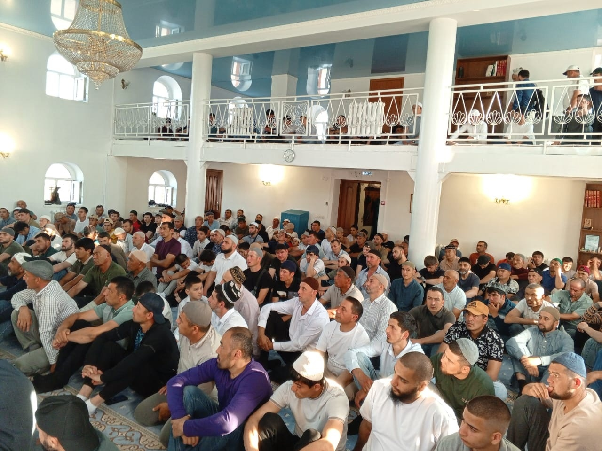
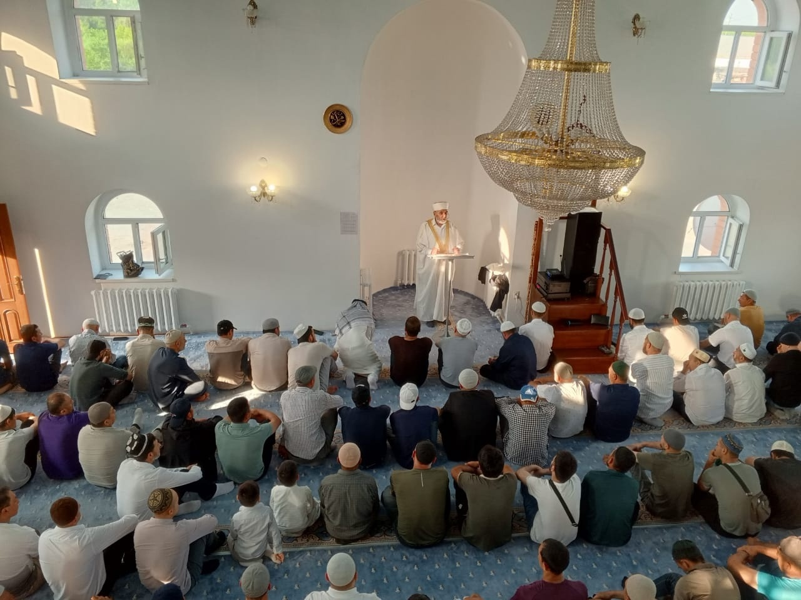
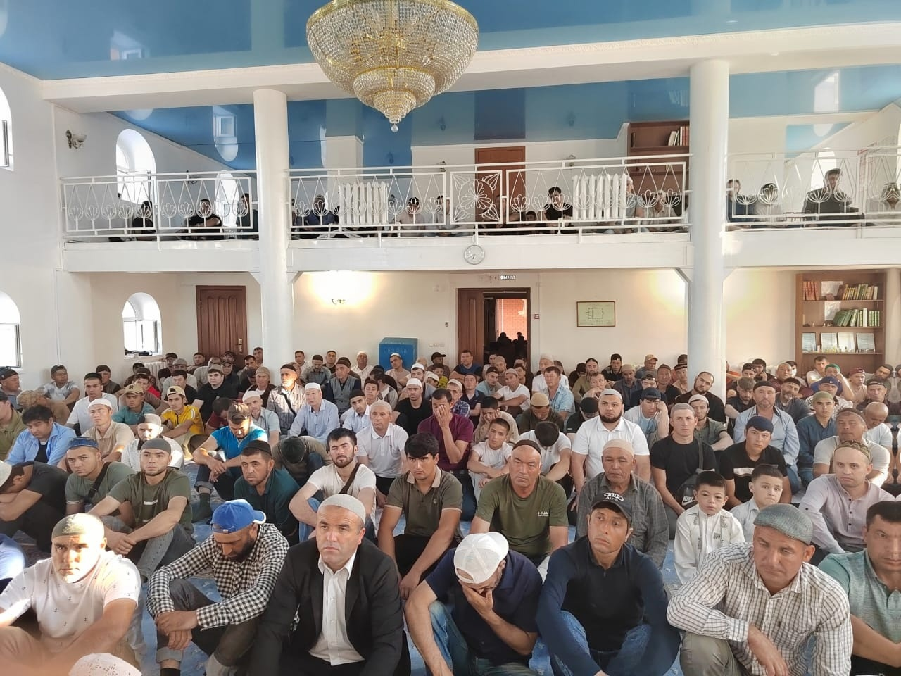
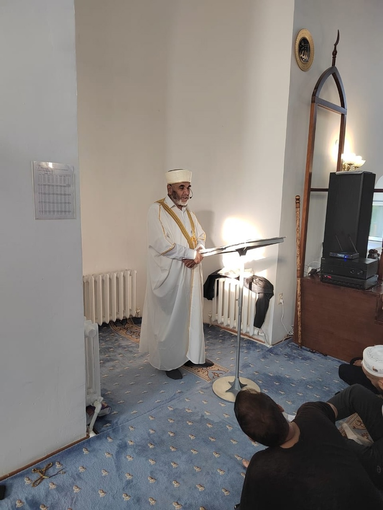

Сегодня, 16 июня 2024 года в Курганской Соборной мечети состоялась праздничная молитва и проповедь в честь великого мусульманского 
праздника - Ид Аль-Адха (Курбан Байрам).

Зиёдали Хаджи Мизробов в своей проповеди напомнил об истории пророка Ибрахима и его сына Исмаила, о преданности человека Аллаху 
и о Милосердии Аллаха к Его праведным рабам.
Также Зиёдали Курбонович напомнил о важности праздника и поздравил верующих: "Сегодня мы собрались все вместе чтобы 
отпраздновать этот великий праздник жертвоприношения. Всевышний также соберёт всех нас в Судный день, день когда будут собраны 
все люди и джинны. И из них будут те, кто возьмёт  свиток своих дел правой рукой, и из них будут те, кто возьмет его левой рукой. Так вспомните же об этом и стремитесь, стать из тех, кому свиток будет дан в правую руку.

Прошу Всевышнего Аллаха, одарить нас Своей милостью и благословением, чтобы Он, в эти праздничные дни, принял все наши старания 
на его пути, простил нам наши прегрешения.
Пусть Создатель ниспошлет всем жителям земли мирного неба над головой и здоровья, Пусть благодать этого праздника дойдет до 
каждого из нас!"

После проповеди верующие совершили праздничный намаз и праздничные такбиры.

