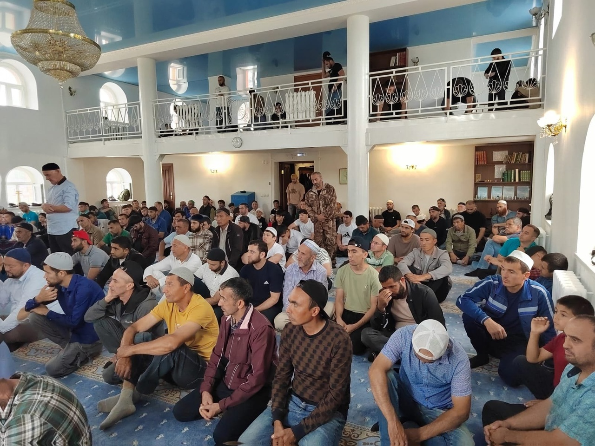

Мечеть - это правильный путь, мечеть - это врата Рая, мечеть - это свет. Мы восхваляем Аллаха Субханаху Ва Тааля, что наши мечети открыты и есть возможность приходить, читать намаз, слушать проповеди, получать знания.

قال الله سبحانه وتعالى:

وَأَنَّ ٱلْمَسَٰجِدَ لِلَّهِ فَلَا تَدْعُوا مَعَ ٱللَّهِ أَحَدًا

"Мечети принадлежат Аллаху. Не взывайте же ни к кому наряду с Аллахом", сура Аль-Джин, 18 аят.

يَٰبَنِىٓ ءَادَمَ خُذُوا زِينَتَكُمْ عِندَ كُلِّ مَسْجِدٍ وَكُلُوا وَٱشْرَبُوا وَلَا تُسْرِفُوٓا۟ ۚ إِنَّهُ ۥ لَا يُحِبُّ ٱلْمُسْرِفِينَ

"О сыны Адама! Облекайтесь в свои украшения при каждой мечети. Ешьте и пейте, но не излишествуйте, ибо Он не любит тех, кто излишествует." сура Аль-А'раф, 31 аят.

В хадисе говорится:

سَمِعْتُ رَسُولَ اللَّهِ ﷺ يَقُولُ: «مَنْ بَنَى مَسْجِدًا يُذْكَرُ فِيهِ اسْمُ اللَّهُ، بَنَى اللَّهُ لَهُ بَيْتًا فِي الْجَنَّةِ

«Кто построит мечеть ради Аллаха, тому Аллах построит такой же дом в Раю», (Тирмизи).

