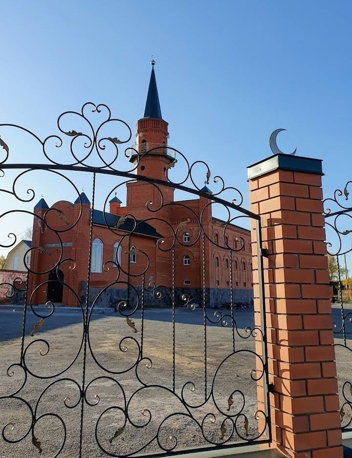

---
title:
---

Ассаляму алейкум ва рахматуллахи ва баракятух уважаемые братья и сестры.

11 октября в Курганской Соборной мечети состоялась проповедь на тему: "Завоевание Мекки". Зиёдали Курбонович рассказал историю о том как 
мусульмане сражались за Мекку. "Фатх Мекки имел величайщее значение. Это был священный город, известный всем. 
Его основное население составляют курайшиты - представители могущественного и уважаемого племени арабов. 
До этого еще ни один царь, ни одна сила в истории не смогли завоевать Мекку. Курайшиты оказывали серьезное влияние на другие племена. 
Многие племена были союзниками курайшитов и поэтому не принимали Ислам, боясь нарушить союз с ними. 
Еще большая их часть выжидала, чем закончится противостояние Пророкаﷺи курайшитов. Они рассуждали так.
В первую очередь, дарование Посланнику Аллахаﷺфатха Мекки, не дарованного прежде никому, стало подтверждением его истинного пророческого 
статуса. Во-вторых, Курайш принял Ислам всем племенем, что избавило от колебаний остальные племена.
Все арабские племена стали приходить большими группами и принимать Ислам.

Хвала Аллаху, Который сказал в Священном Кур'ане:

إِذَا جَآءَ نَصْرُ ٱللَّهِ وَٱلْفَتْحُ
وَرَأَيْتَ ٱلنَّاسَ يَدْخُلُونَ فِى دِينِ ٱللَّهِ أَفْوَاجًا
فَسَبِّحْ بِحَمْدِ رَبِّكَ وَٱسْتَغْفِرْهُ ۚ إِنَّهُ ۥ كَانَ تَوَّابا

"Когда придет помощь Аллаха и настанет победа, когда ты увидишь, как люди толпами обращаются в религию Аллаха, восславь же хвалой Господа 
своего и попроси у Него прощения. Воистину, Он - Принимающий покаяния." Сура Ан-Наср, 1-2 аяты.

